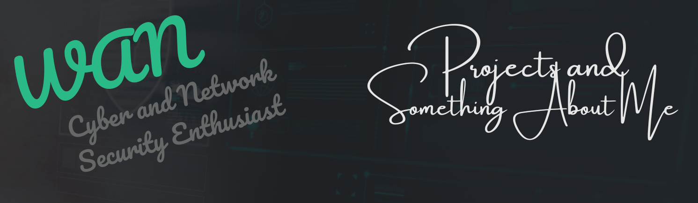

  

---

## 👋 Hi folks, this is Wan

> "Because why not? Heard computers only understand zeros and ones—so I choose to be the **positive one**."

---

### ⚡️ Meet the Aspiring Network Vigilante

From editing podcasts (which turned out to be my gateway into the world of cybersecurity) to becoming a passionate **Digital Security Enthusiast**, my journey has been nothing short of transformative.

Every single day, I am driven by one question: **How do we secure the ever-interconnected world?** 

🔐 By leveraging evolving security tools and maintaining a learner’s mindset, I'm committed to digesting the rigorous processes of cybersecurity—all while enjoying the ride.

---

### 🧠 How I'd Define Me... Literally

- 🎓 Pivoting assiduously into **Cybersecurity** after earning a Bachelor's degree in **Media and Communication**
- 🌐 Keen interest in **Network Security**, **Cloud Security**, and **Regulatory Compliance**
- 🚀 Passionate about creating a safer digital ecosystem than I met

#### 🤯 Fun Fact
I had no prior background in tech—like, I *literally* had no idea what "binary digits" meant just six months ago.

#### 🔧 At the Moment
- 📌 Taking on challenging projects to gain hands-on experience
- 📓 Sharpening my skills in configuring basic network security tools and documenting the process for other absolute beginners
- 📡 Staying up-to-speed with the evolving digital landscape to identify and defend against common vulnerabilities

#### 🏃 In My Free Time
- 📚 Reading books on **Networking** and **Social Engineering**
- 🏃‍♂️ Running the streets (yes, literally) trying to catch my breath and clear my head

---

### 📬 Get in Touch

---

### 🧰 Stack

   

---

> _Curated with care, curiosity, and a cybersecurity state of mind. ⭐️_
